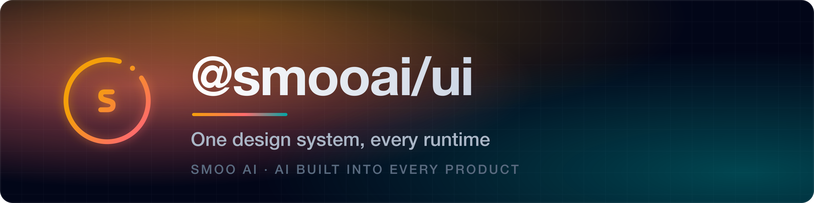
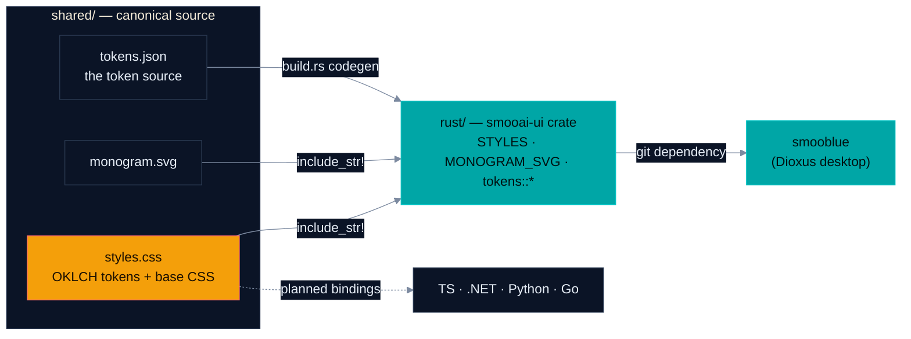

<a name="readme-top"></a>

<p align="center">
  <a href="https://smoo.ai"></a>
</p>

<p align="center">
  <a href="https://smoo.ai"></a>
  <a href="./LICENSE"></a>
  <a href="https://smoo.ai/open-source"></a>
</p>

<p align="center">
  
  
  
</p>

<p align="center">
  <a href="#what-is-this"><b>What it is</b></a> &nbsp;·&nbsp; <a href="#feature-tour"><b>Feature tour</b></a> &nbsp;·&nbsp; <a href="#quickstart-rust"><b>Quickstart</b></a> &nbsp;·&nbsp; <a href="#status"><b>Honest status</b></a> &nbsp;·&nbsp; <a href="#relationship-to-client-shared"><b>client-shared</b></a> &nbsp;·&nbsp; <a href="#-part-of-smoo-ai"><b>Platform</b></a>
</p>

---

> **"Smoo green" should never depend on which runtime painted it.** This repo holds the canonical Smoo AI design source — one CSS file of OKLCH tokens + base component classes, the smoo monogram, and a JSON token export — under [`shared/`](shared/), with language bindings that embed those files at build time. Today that means **one shipped binding: Rust** (`smooai-ui`, consumed by [smooblue](https://github.com/SmooAI/smooblue) as a git dependency); a TypeScript package lives in the `SmooAI/smooai` monorepo and other bindings are planned, not built.

## What is this?

Smoo AI runs on more than one UI runtime — `apps/web` (Next.js / Tailwind), `smooblue` (Dioxus desktop), `observability-studio` (Dioxus viewer). Without a single source of truth, brand colors drift silently between them.

This repo is that source of truth:

- [`shared/styles.css`](shared/styles.css) — the canonical OKLCH tokens + base component CSS (~425 lines). **This file is the design system.**
- [`shared/monogram.svg`](shared/monogram.svg) — the smoo monogram, `fill="currentColor"`.
- [`shared/tokens.json`](shared/tokens.json) — the tokens as plain JSON, and the **input the Rust constants are generated from**: `rust/build.rs` runs [`shared/tokens_codegen.rs`](shared/tokens_codegen.rs) over it at build time, so a token cannot exist in the design system and be missing from Rust. [`shared/tokens_css_check.rs`](shared/tokens_css_check.rs) then asserts it agrees with `styles.css` in both directions. A future binding in any language reads the same file.
- [`rust/`](rust/) — the `smooai-ui` crate: `include_str!` constants over the shared files, plus a mirrored `tokens::*` module for non-DOM frameworks. Zero dependencies, `no_std`.



---

## Feature tour

| | What | Where |
| --- | --- | --- |
| 🎨 | [**Canonical OKLCH tokens + base CSS**](#-the-canonical-stylesheet) | `shared/styles.css` → `smooai_ui::STYLES` |
| 🟢 | [**Token values as Rust constants**](#-tokens-outside-the-dom) | `smooai_ui::tokens::*` for egui / native chrome / charts |
| 🔤 | [**The smoo monogram**](#-the-monogram) | `shared/monogram.svg` → `smooai_ui::MONOGRAM_SVG` |
| 🧪 | [**Drift-detector tests**](#-drift-detection) | `cargo test -p smooai-ui` fails if consts and CSS diverge |

### 🎨 The canonical stylesheet

`shared/styles.css` carries the whole system — dark mode is the only mode, and every color is a token:

- **OKLCH brand palette** — `--color-smooai-orange`, `--color-smooai-red`, `--color-smooai-green`, the blue scale, the dark-blue scale
- **Semantic tokens** — `--background`, `--foreground`, `--card`, `--muted`, `--border`, `--ring`, `--sidebar`
- **Brand gradient** — `--gradient-brand` (the signature orange→red 135° gradient)
- **Geometry** — `--radius`, spacing scale, type stack
- **Base components** — the `.btn` family, `.card`, `.fab`, `.modal__sheet`, `.rail`, `.brand-badge`, input classes
- **Reset + base + scrollbars**

In a Dioxus app, inject it once at the root (real API — this is the whole integration):

```rust
use dioxus::prelude::*;

fn App() -> Element {
    rsx! {
        // Inject the canonical brand stylesheet once at the root component.
        style { "{smooai_ui::STYLES}" }

        // Use the BEM classes everywhere.
        div { class: "card",
            button { class: "btn btn--primary", "Save" }
        }
    }
}
```

### 🟢 Tokens outside the DOM

For non-DOM frameworks (egui, iced, native menus, chart libraries), reference token values directly — mirrored from the CSS and guarded by the drift test:

```rust
let accent = smooai_ui::tokens::SMOOAI_GREEN;      // "oklch(0.657 0.112 194.8)"
let bg     = smooai_ui::tokens::BACKGROUND;        // "oklch(0.145 0.014 265)"
let grad   = smooai_ui::tokens::GRADIENT_BRAND;    // orange→red 135° gradient string
let radius = smooai_ui::tokens::RADIUS_PX;         // 10
```

### 🔤 The monogram

`MONOGRAM_SVG` ships with `fill="currentColor"` so surrounding CSS controls the color. Pair with `.brand-badge` for the gradient pill backdrop:

```rust
rsx! {
    div {
        class: "brand-badge",
        style: "width:32px;height:32px;",
        dangerous_inner_html: "{smooai_ui::MONOGRAM_SVG}",
    }
}
```

### 🧪 Drift detection

The `tokens` constants are generated from `shared/tokens.json`, so they cannot fall behind it. What still needs checking is the CSS, and the check runs in **both** directions:

```bash
cd rust && cargo test
# tokens_match_css         — each token equals the RESOLVED value of its custom
#                            property in :root (var() references followed), not
#                            merely "appears somewhere in the file"
# css_colors_are_all_tokens — every colour :root declares has a token, so a new
#                            colour can't reach the CSS and no language binding
# semantic_classes_exist   — .btn, .btn--primary, .card, .rail, .brand-badge, …
```

CI (`.github/workflows/rust.yml`) runs `cargo fmt --check`, `clippy --all-targets -D warnings`, the tests, a module-tree check (no `.rs` file unreachable from a `mod` declaration), and the `shared/` drift gate below.

---

## Quickstart (Rust) <a name="quickstart-rust"></a>

**`smooai-ui` is not published to crates.io.** Consume it as a git dependency — this is exactly how [smooblue](https://github.com/SmooAI/smooblue) consumes it today:

```toml
[dependencies]
smooai-ui = { git = "https://github.com/SmooAI/ui.git", branch = "main" }
```

The crate is a pure `pub const &'static str` carrier: zero dependencies, `no_std`, so it never pins your UI framework's version.

---

## Status

The honest per-language picture — one binding exists, the rest are direction, not code:

| Language | Package | Status |
| --- | --- | --- |
| **Rust** | `smooai-ui` | ✅ **In-repo, working** — consumed by [smooblue](https://github.com/SmooAI/smooblue) via git dependency. **Not published to crates.io.** |
| **TypeScript** | `@smooai/ui` | 🚧 Lives today inside the [`SmooAI/smooai`](https://github.com/SmooAI/smooai) monorepo at `packages/ui`; graduating here is aspirational |
| **.NET** | `SmooAI.Ui` | 📦 Planned — no code exists |
| **Python** | `smooai-ui` | 📦 Planned — no code exists |
| **Go** | `github.com/SmooAI/ui/go` | 📦 Planned — no code exists |

## Relationship to client-shared

**This repo owns the design system. [`SmooAI/client-shared`](https://github.com/SmooAI/client-shared) is an auth library and carries no copy of it.**

It used to. client-shared declared itself this crate's successor and kept a byte-identical `shared/`, with a CI gate here failing if the two diverged. That arrangement is retired: an org-wide search found **nothing imported `client_shared::ui`** — its only consumer, the [`th` CLI](https://github.com/SmooAI/smooth), builds `features = ["auth"]` and never touched the design half. So the duplicate was deleted at the source rather than policed forever, and the gate went with it.

> The duplication was not hypothetical. The two copies **had** already diverged: the monogram fix in `f230808` ("restore the inner 'S' curve and the dot") never crossed, so client-shared served a monogram with no S and no dot, and its `styles.css` lost the whole `.input` family. Nothing was red. Deleting the copy removes the failure mode instead of detecting it.

Design changes land here, and only here. Consumers today are [`observability-studio`](https://github.com/SmooAI/observability) and [smooblue](https://github.com/SmooAI/smooblue).

## Versioning

Per-language packages share the same semver line so consumers can correlate versions across runtimes.

| Bump | Triggers |
| --- | --- |
| **Patch** | Token value tweaks, CSS rule additions, bug fixes |
| **Minor** | New tokens, new component classes, new monogram variants — additive only |
| **Major** | Token renames, removed classes, breaking layout assumptions |

## 🧩 Part of Smoo AI

`@smooai/ui` is built and open-sourced by **[Smoo AI](https://smoo.ai)** — the AI-powered business platform with AI built into every product: CRM, customer support, campaigns, field service, observability, and developer tools.

- 🧰 **More open source from Smoo AI** — [smoo.ai/open-source](https://smoo.ai/open-source)
- 🧩 **Sibling packages** — [client-shared](https://github.com/SmooAI/client-shared) (auth for the `th` CLI), [@smooai/logger](https://github.com/SmooAI/logger), [@smooai/utils](https://github.com/SmooAI/utils), [@smooai/file](https://github.com/SmooAI/file), [smooth](https://github.com/SmooAI/smooth) (the `th` CLI)

## 🤝 Contributing

PRs welcome. Keep this surface narrow — only add a token or class when at least two apps need it. **Design-system changes land here** — this repo is the single source. Add tokens to `shared/tokens.json` (the Rust constants generate from it) rather than to the CSS alone.

## 📄 License

MIT — see [LICENSE](./LICENSE).

---

<p align="center">
  Built by <a href="https://smoo.ai"><strong>Smoo AI</strong></a> — AI built into every product.
</p>
